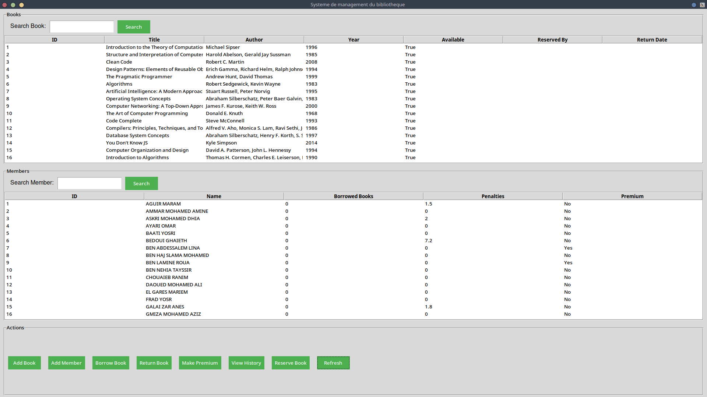

# Library Management System

A Python-based application utilizing Tkinter for the graphical user interface (GUI) to manage library operations efficiently.

## Table of Contents

- [Introduction](#introduction)
- [Features](#features)
- [Usage](#usage)
- [File Structure](#file-structure)
- [Contributing](#contributing)
- [preview](#preview)
- [License](#license)

## Introduction

This project is a library management system designed to streamline the process of managing books, users, and transactions within a library setting. 
The application provides a user-friendly interface for librarians and staff to perform daily operations efficiently.

## Features

- **Book Management**: Add, update, delete, and search for books.
- **User Management**: Manage library members, including adding, updating, and removing users.
- **Transaction Management**: Handle book checkouts, returns, and track overdue items.
- **Reporting**: Generate reports on library usage, popular books, and user activity.

## Installation

1. **Clone the Repository**:

   ```bash
   git clone https://github.com/meduk0/-project--systeme-de-gestion-du-bibliotheque-.git
   cd -project--systeme-de-gestion-du-bibliotheque-
   ```

2. **You need python ,tkinter(tk)**

## Usage

1. **Run the Application**:

   ```bash
   python libraryui.py
   ```

2. **Interface Overview**:

   - **Dashboard**: Overview of library statistics.
   - **Books**: Section to manage book records.
   - **Users**: Section to manage library members.
   - **Transactions**: Manage book checkouts and returns.
   - **Reports**: Generate and view various reports.


## File Structure

- `core.py`: Contains all the core classes and logic for the application.
- `libraryui.py`: Manages the Tkinter GUI components and data presentation.
- `exemple.py`: Includes example data to populate the library database.
- `README.md`: Project documentation (still need work).

## Contributing

Contributions are welcome! fork it and do your things! 😉
1. **Fork the Repository**.
    ```bash
    git clone https://github.com/meduk0/-project--systeme-de-gestion-du-bibliotheque-
    ```
2. **Create a New Branch**:

   ```bash
   git checkout -b feature/YourFeatureName
   ```

3. **Commit Your Changes**:

   ```bash
   git commit -m 'Add some feature'
   ```

4. **Push to the Branch**:

   ```bash
   git push origin feature/YourFeatureName
   ```

5. **Open a Pull Request**.

## Preview

## License

This project is licensed under the MIT License. See the [LICENSE](LICENSE) file for details.
